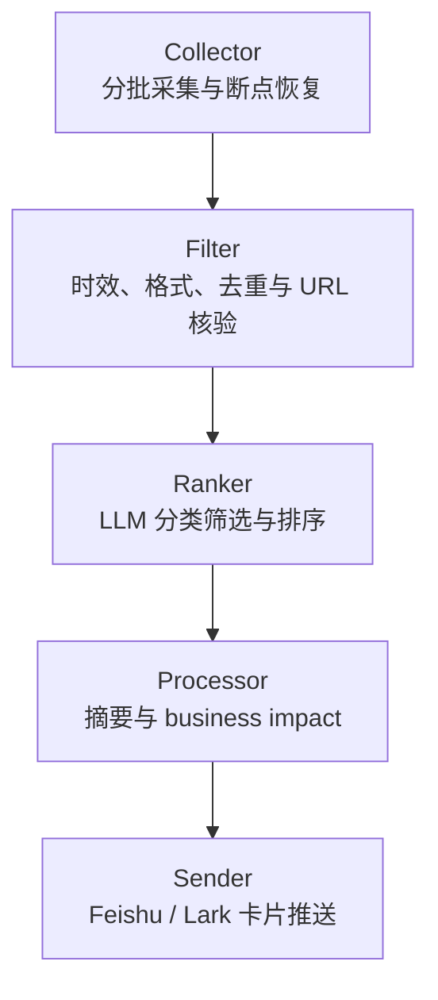

# Global Market News Bot

## 全球市场资讯机器人｜个人作品集展示版

本仓库是基于本人实习期间参与开发的市场资讯自动化项目所制作的脱敏展示版 Replica，仅用于个人作品集展示与技术交流。

本仓库并非原公司内部生产仓库，也不代表原公司进行官方开源。当前版本仅保留项目的核心架构、工作流设计与技术实现思路，并已删除或泛化生产环境凭证、内部基础设施信息、公司内部业务信息、专有数据、客户信息及其他敏感内容。

展示版与原内部项目在业务上下文、配置、数据及部署环境上存在差异，不应视为原生产系统的完整复制。

## 1. 项目简介

Global Market News Bot 是一个基于 Node.js 和大模型 API 的模块化资讯处理流水线。系统面向全球市场研究场景，完成新闻搜索与采集、规则过滤、LLM 排序、摘要与 business impact 分析，并将结构化结果通过 Feishu / Lark Webhook 推送为消息卡片。

生产版本曾覆盖 15 个海外市场。内部测试中，通过分批调度、失败重试和断点恢复，新闻检索成功率由约 65% 提升至 98%。这些数据用于说明工程稳定性优化过程，不代表商业化上线、外部用户规模或收入成果。

## 2. 展示版说明

这是一个为作品集准备的 Replica：代码来源于项目当前最终状态，但仓库使用全新的 Git 历史。展示版不包含原仓库的 commit、branch、tag、issue、PR、release 或 Actions 历史，也不包含已经从当前版本删除的文件。

本仓库不包含：

- 真实 API Key、Webhook 或 Secret
- 内部服务器、IP、账号、部署路径和运行日志
- 客户信息、专有数据或真实生产新闻结果
- `.env`、运行时 JSON、缓存、采集进度文件和 `node_modules`

## 3. 项目背景

全球市场资讯具有来源分散、时效要求高、语言与分类不统一等特点。该项目把重复的资讯整理过程拆成独立模块，让每个阶段通过结构化 JSON 交接，便于定位失败、恢复任务和替换单一环节。

项目保留的业务语境为全球市场资讯、国际化产品研究和全球产品本土化。所有与具体雇主、内部团队、生产基础设施或客户有关的上下文均已删除或泛化。

## 4. 系统架构



模块之间使用 JSON 文件传递结果：

```text
candidate-news.json
→ filtered-news.json
→ ranked-news.json
→ processed-news.json
```

这些文件只在本地运行时生成，并由 `.gitignore` 排除。

## 5. 工作流程

1. **Collector** 按市场与分类生成检索任务，分批执行新闻搜索。
2. **Filter** 校验发布时间和 URL，去除过期、重复或不可用结果。
3. **Ranker** 使用 Prompt Engineering 对候选新闻做分类核验、重要性判断和排序。
4. **Processor** 调用 OpenAI-compatible LLM API，生成中文摘要和 business impact，并校验结构化 JSON。
5. **Sender** 生成 Feishu / Lark 交互卡片，使用签名后的 Webhook 完成推送。

入口脚本 `automation/run-news-bot.mjs` 按顺序调度各模块，并把运行日志写入本地 `logs/` 目录。

## 6. 核心功能

- 覆盖 15 个海外市场的可配置采集范围
- 按政治、汽车、科技、文化和娱乐分类检索
- 新闻时效、格式、国家相关性和重复项过滤
- 基于 LLM 的分类校验与 Top-N 排序
- 中文摘要和 business impact 分析
- 严格 JSON 输出与解析校验
- Feishu / Lark Webhook 卡片生成与签名
- 模块化 pipeline 与自动化执行入口

## 7. 稳定性优化

采集阶段把市场拆成多个批次，并在请求间加入可配置延迟与随机抖动。系统会把当前任务、已收集结果和报告写入本地 checkpoint；遇到限流或进程退出时，可从断点继续。

LLM 排序与处理阶段会区分可重试的网络、限流、服务端和 JSON 解析错误，以及不应重试的认证错误。每个模块独立落盘，使失败不会迫使整条流水线从头执行。

## 8. 技术栈

- Node.js 20+
- JavaScript ES Modules
- OpenAI-compatible LLM API
- Prompt Engineering
- Fetch API 与 AbortSignal
- Structured JSON
- Feishu / Lark Webhook
- HMAC-SHA256 签名
- Batch scheduling、retry、checkpoint recovery

## 9. 项目结构

```text
global-market-news-bot/
├── automation/
│   └── run-news-bot.mjs
├── config/
│   └── baiduSearchSources.json
├── modules/
│   ├── newsCollector.mjs
│   ├── newsSearcher.mjs
│   ├── newsFilter.mjs
│   ├── newsRanker.mjs
│   ├── newsProcessor.mjs
│   ├── send-card.mjs
│   └── tokenUsage.mjs
├── tests/
│   ├── test-baidu-collector.mjs
│   └── test-news-processing.mjs
├── .env.example
├── .gitignore
├── package.json
└── package-lock.json
```

`data/` 和 `logs/` 在运行时自动创建，不进入版本控制。

## 10. 环境配置

复制模板并填写自己的测试凭证：

```bash
cp .env.example .env
```

主要配置：

| 环境变量 | 用途 |
| --- | --- |
| `ANALYSIS_API_KEY` | LLM API 密钥 |
| `ANALYSIS_BASE_URL` | OpenAI-compatible API 基础地址 |
| `ANALYSIS_MODEL` | 模型名称 |
| `FEISHU_WEBHOOK` | Feishu / Lark 机器人 Webhook |
| `FEISHU_SECRET` | Webhook 签名密钥 |
| `BAIDU_SEARCH_*` | 采集超时、重试、延迟、抖动和批次参数 |

`.env.example` 中只有占位符，不能直接用于生产环境。

## 11. 本地运行

安装依赖：

```bash
npm ci
```

运行完整流水线：

```bash
npm start
```

运行保留的架构测试：

```bash
npm run test:collector -- 泰国
npm run test:processor
```

完整运行会访问新闻搜索、LLM 和 Feishu / Lark 服务，请先使用自己的测试环境配置。云端部署时，可由 cron、systemd timer 或受管调度服务在工作日触发 `npm start`；具体生产基础设施配置不在本展示版中。

## 12. 设计思路

项目优先保证可恢复性和可检查性。采集、过滤、排序、生成和发送分离后，每一步都能独立观察输入输出；结构化 JSON 降低了 LLM 输出的不确定性；checkpoint 则把长时采集任务从一次性脚本变为可继续执行的工作流。

排序和摘要由两个 Prompt 分别完成。Ranker 关注国家相关性、分类准确性、信源质量、时效性和重要性，Processor 负责忠实摘要与业务价值，减少单个 Prompt 同时承担过多任务造成的偏差。

## 13. 局限性

- HTML 解析依赖公开页面结构，目标页面变化可能导致采集失效。
- URL 的 HEAD 核验采用宽松策略，部分站点拒绝 HEAD 请求时仍会保留结果。
- 新闻分类、排序和摘要受模型质量影响，仍需要人工抽检。
- 展示版没有包含生产监控、告警、凭证管理和基础设施配置。
- 示例不构成对任何搜索服务、LLM 服务或消息平台的可用性承诺。

## 14. 脱敏与隐私说明

发布前已逐文件审查代码、配置、Prompt、注释、测试和文档，并删除或泛化公司名称、员工账号、内部项目名称、内部业务上下文、服务器信息、部署路径、运行日志、生产数据和凭证。

本仓库仅用于个人作品集展示和技术交流，不是原生产仓库，也不是原公司的官方开源项目。请勿在仓库、Issue 或日志中提交真实 API Key、Webhook、Secret、客户信息或生产数据。

